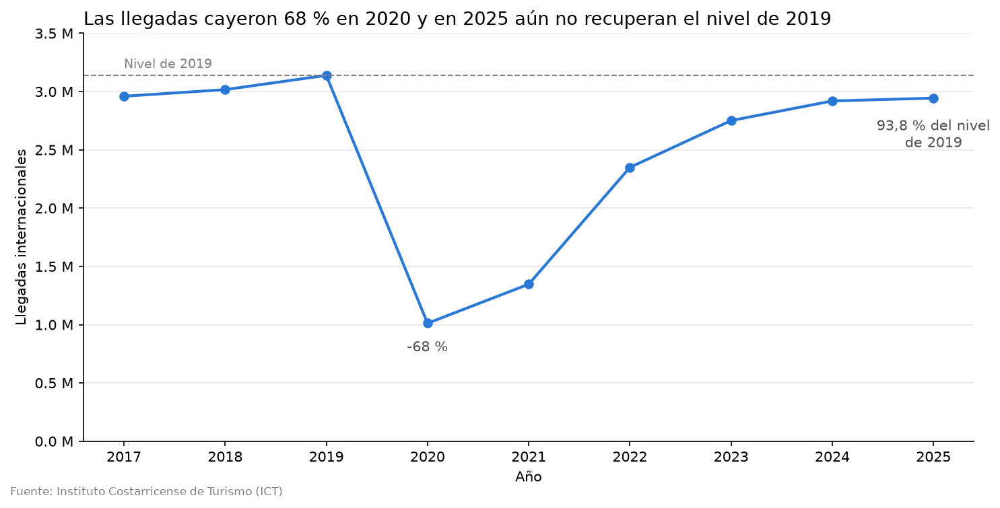
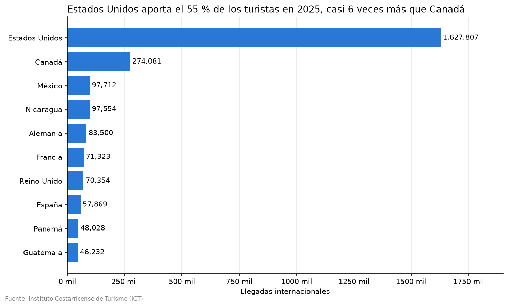
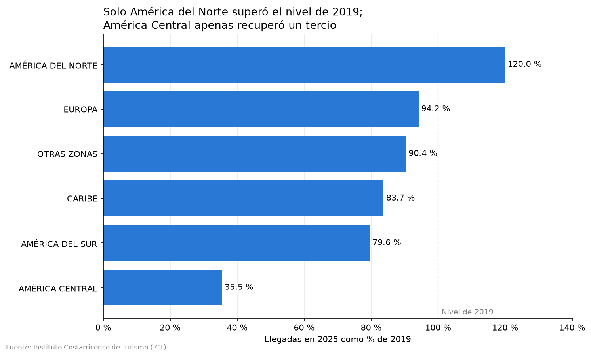
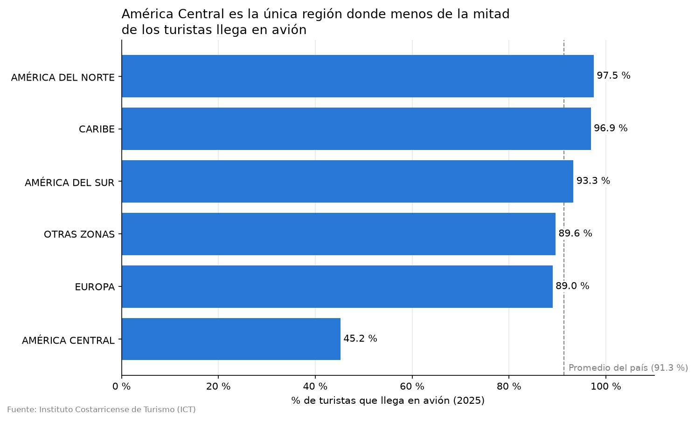

# Turismo en Costa Rica: llegadas internacionales 2017-2025

Este proyecto analiza las llegadas internacionales de turistas a Costa Rica entre 2017 y 2025, con datos oficiales del Instituto Costarricense de Turismo (ICT). El objetivo es entender cómo ha evolucionado el turismo en el país, cuánto lo afectó la pandemia y de dónde provienen sus visitantes.

## Preguntas de análisis

1. **Evolución:** ¿cómo han cambiado las llegadas internacionales entre 2017 y 2025? ¿Cuánto cayeron durante la pandemia y en qué año se recuperó el nivel de 2019?
2. **Estacionalidad:** ¿qué meses concentran más llegadas de turistas? ¿El patrón de temporada alta y baja es igual para todos los mercados de origen? *(fase 2: requiere datos mensuales)*
3. **Mercados de origen:** ¿qué países y regiones aportan más turistas? ¿Todos los mercados se recuperaron de la misma forma después de la pandemia?
4. **Puertas de entrada:** ¿qué proporción de turistas llega por vía aérea frente a la vía terrestre y marítima? ¿Varía según la región de origen? *(el detalle por aeropuerto queda para la fase 2)*

## Hallazgos principales

**1. Las llegadas no se han recuperado del todo.** En 2020 cayeron un 67,8 %, y en 2025 todavía están en el 93,8 % del nivel de 2019.



**2. Fuerte dependencia de Estados Unidos.** Aporta el 55 % de los turistas, casi 6 veces más que Canadá.



**3. La recuperación es muy desigual entre regiones.** Solo América del Norte superó su nivel de 2019 (+20 %), mientras que América Central apenas recuperó el 35,5 %.



**4. Más llegadas por avión, en proporción.** El porcentaje que llega por vía aérea subió del 77 % en 2019 al 91,3 % en 2025. Se explica por la caída de las llegadas terrestres de América Central, la única región donde menos de la mitad llega en avión.



## Datos

- **Fuente:** Instituto Costarricense de Turismo (ICT), [Informes estadísticos](https://www.ict.go.cr/es/estadisticas/informes-estadisticos.html)
- **Periodo:** 2017-2025
- **Contenido:** llegadas internacionales por año, país y región de origen, en total y por vía aérea. Los datos limpios tienen las variables `region`, `pais`, `anio`, `llegadas` y `llegadas_aereas`.

## Estructura del repositorio

```
turismo-costa-rica/
├── data/
│   ├── raw/                  # Datos originales del ICT
│   └── processed/            # Datos limpios (todas las vías y vía aérea)
├── notebooks/
│   ├── 01_limpieza.ipynb     # Limpieza y validación de datos
│   └── 02_eda.ipynb          # Análisis exploratorio
├── figures/                  # Gráficos del análisis
├── requirements.txt          # Librerías necesarias
└── README.md
```

## Cómo ejecutarlo

1. Clonar el repositorio:

```bash
git clone https://github.com/DanielleEspinoza/turismo-costa-rica.git
cd turismo-costa-rica
```

2. Crear y activar un entorno virtual:

```bash
python3 -m venv .venv
source .venv/bin/activate
```

3. Instalar las librerías:

```bash
pip install -r requirements.txt
```

4. Abrir los notebooks de la carpeta `notebooks/` en orden.

## Estado del proyecto

- [x] Limpieza y validación de datos
- [x] Análisis exploratorio
- [x] Conclusiones
- [ ] Fase 2: extracción de datos mensuales y por aeropuerto de los informes PDF del ICT

## Autora

**Danielle Espinoza**, estudiante de Ingeniería en Ciencia de Datos en LEAD University.

[LinkedIn](https://www.linkedin.com/in/danielle-espinoza-abarca-8a9a2b38b)